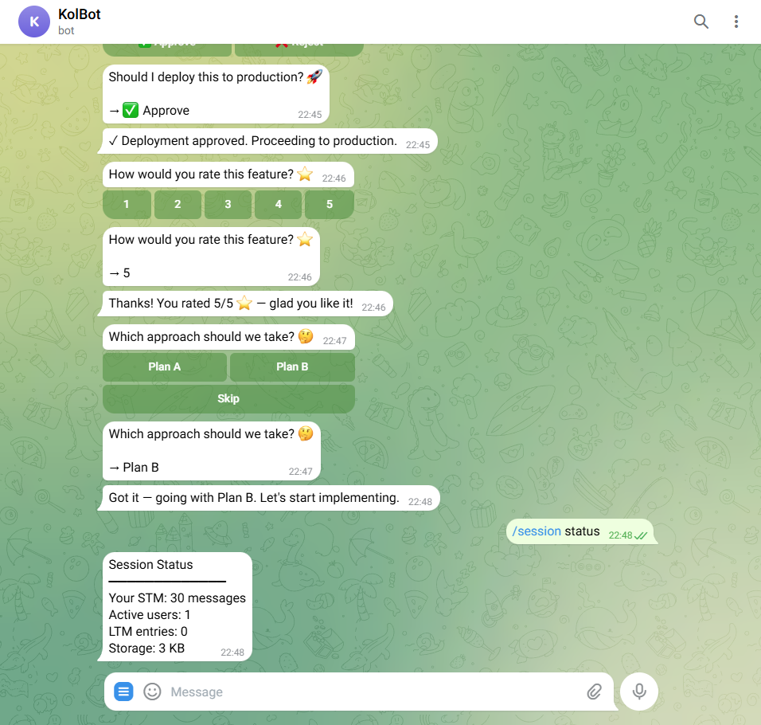
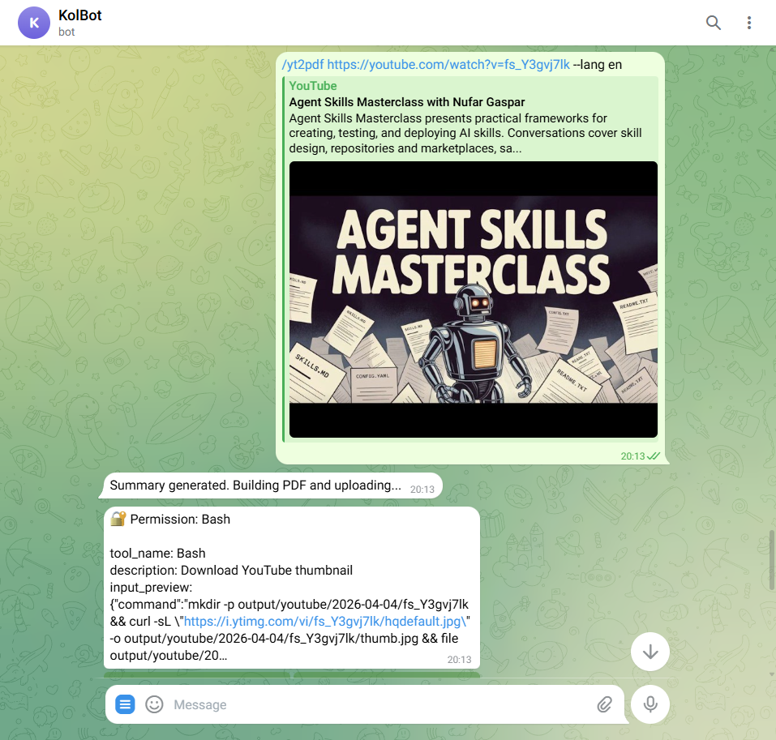
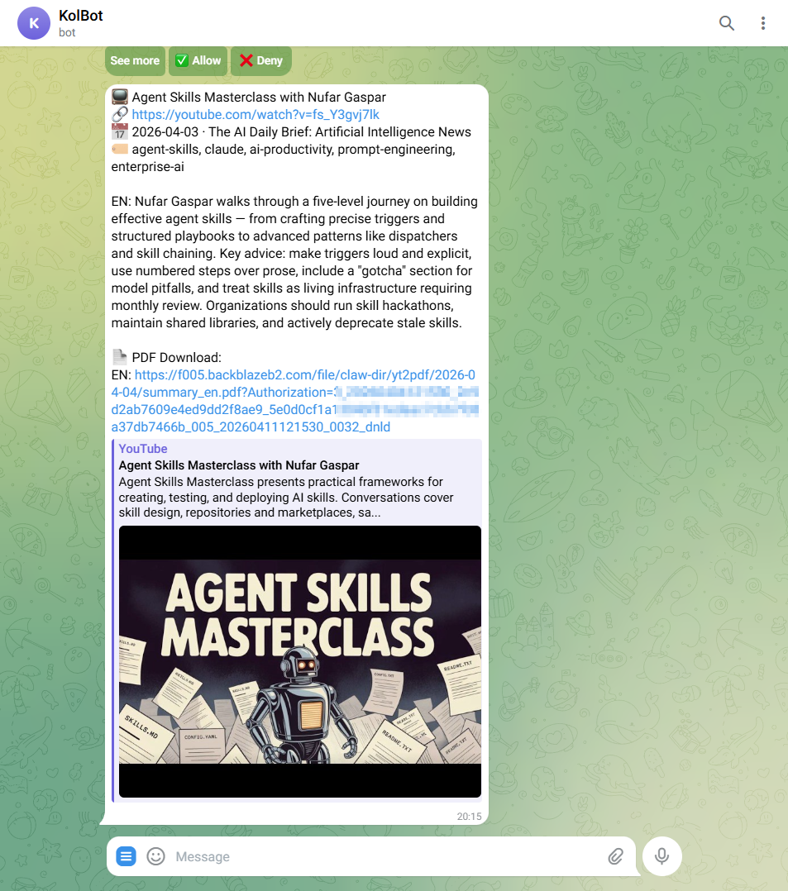

# claude-code-channels

[](https://github.com/osisdie/claude-code-channels/actions/workflows/ci.yml)
[](LICENSE)
[](https://github.com/osisdie/claude-code-channels/issues)
[](https://github.com/osisdie/claude-code-channels/stargazers)
[](https://bun.sh/)
[](https://docs.anthropic.com/en/docs/claude-code)
[](https://github.com/osisdie/claude-code-channels/releases)

English | [繁體中文](README.zh-TW.md)

Connect Claude Code to messaging platforms for bidirectional, remote interaction with your local AI agent.

## What This Is

A project-level setup for running [Claude Code](https://docs.anthropic.com/en/docs/claude-code) with the official Channels plugin system. Send tasks from your phone, approve risky operations remotely, and share files -- all through your preferred messaging app.

## Supported Channels

| Channel | Status | Docs |
| ------- | ------ | ---- |
| [](docs/telegram/) |  | [docs/telegram/](docs/telegram/) |
| [](docs/discord/) |  | [docs/discord/](docs/discord/) |
| [](docs/slack/) |  | [docs/slack/](docs/slack/) |
| [](docs/line/) |  | [docs/line/](docs/line/) |
| [](docs/whatsapp/) |  | [docs/whatsapp/](docs/whatsapp/) |
| [](docs/teams/) |  | [docs/teams/](docs/teams/) |

## Quick Start

### Prerequisites

- [Bun](https://bun.sh/) runtime
- Claude Code v2.1.80+
- A bot token for your target channel (e.g., Telegram's [@BotFather](https://t.me/BotFather))

### Setup

1. **Clone and configure:**

   ```bash
   git clone https://github.com/osisdie/claude-code-channels.git
   cd claude-code-channels
   cp .env.example .env
   # Edit .env — add your bot token(s)
   ```

2. **Install a channel plugin** (inside a Claude Code session):

   ```text
   /plugin marketplace add anthropics/claude-plugins-official
   /plugin install telegram@claude-plugins-official
   /telegram:configure <YOUR_BOT_TOKEN>
   ```

3. **Pair your account** (varies per channel — see channel docs).

4. **Launch:**

   ```bash
   ./start.sh telegram
   ```

## Docker (Broker Channels)

Each broker channel can run as an isolated Docker container:

```bash
# Build and run WhatsApp broker
docker compose up whatsapp

# Run multiple brokers
docker compose up slack whatsapp

# Run all brokers
docker compose up
```

> **Note:** Set `ANTHROPIC_API_KEY` in your `.env` file. The Claude CLI authenticates via API key inside the container.

## Architecture

```text
Messaging App (Mobile/Desktop)
    | (Platform API, outbound polling by plugin)
Channel Plugin (Bun subprocess, MCP Server)
    | (stdio transport)
Claude Code Session (local, full filesystem access)
```

No inbound ports, webhooks, or external servers needed. WSL2 compatible.

For a deep dive into the official plugin internals, see [Plugin Architecture](docs/plugins/architecture.md).

## Usage Examples

### Remote Task Execution

```text
# From Telegram/Discord, send:
What files changed in the last commit?

# Claude Code executes `git diff HEAD~1` and replies with the diff summary
```

### Approval Workflow

```text
# Claude Code encounters a destructive operation:
Bot: "About to run `rm -rf dist/` — approve or reject?"
You: approve
# Claude Code proceeds
```

### Multi-Channel Launch

```bash
# Start with multiple channels simultaneously
./start.sh telegram discord
```

## Project Structure

```text
.
├── start.sh                  # Multi-channel launcher
├── docker-compose.yml        # Per-broker Docker services
├── docker/                   # Per-channel Dockerfiles
├── .env.example              # Environment variable template
├── .gitignore                # Excludes secrets & channel state
├── CHANGELOG.md
├── CONTRIBUTING.md
├── SECURITY.md
├── LICENSE
├── README.md
├── README.zh-TW.md
├── docs/
│   ├── prerequisites.md      # Shared setup (Bun, Claude Code)
│   ├── prerequisites.zh-tw.md # Shared setup (zh-TW)
│   ├── issues.md             # Known issues (cross-channel)
│   ├── plugins/
│   │   ├── architecture.md       # Official plugin architecture (EN)
│   │   └── architecture.zh-tw.md # Official plugin architecture (zh-TW)
│   ├── telegram/
│   │   ├── plan.md           # Integration planning doc
│   │   ├── plan.zh-tw.md     # Planning doc (zh-TW)
│   │   ├── install.md        # Installation & integration notes
│   │   ├── install.zh-tw.md  # Installation notes (zh-TW)
│   │   └── security.png
│   ├── discord/
│   │   ├── plan.md           # Integration planning doc
│   │   ├── plan.zh-tw.md     # Planning doc (zh-TW)
│   │   ├── install.md        # Installation & integration notes
│   │   └── install.zh-tw.md  # Installation notes (zh-TW)
│   ├── slack/
│   │   ├── plan.md           # Integration plan (MCP only, not channel)
│   │   ├── install.md        # Installation & integration notes
│   │   └── install.zh-tw.md  # Installation notes (zh-TW)
│   ├── line/
│   │   ├── plan.md           # Integration planning doc
│   │   ├── plan.zh-tw.md     # Planning doc (zh-TW)
│   │   ├── install.md        # Installation & integration notes
│   │   └── install.zh-tw.md  # Installation notes (zh-TW)
│   ├── whatsapp/
│   │   ├── plan.md           # Integration planning doc
│   │   ├── install.md        # Installation & integration notes
│   │   └── install.zh-tw.md  # Installation notes (zh-TW)
│   └── teams/
│       ├── plan.md           # Integration planning doc
│       ├── install.md        # Installation & integration notes
│       └── install.zh-tw.md  # Installation notes (zh-TW)
├── external_plugins/
│   ├── slack-channel/
│   │   └── broker.ts         # Slack message broker
│   ├── line-channel/
│   │   ├── broker.ts         # LINE webhook broker (direct, needs ngrok)
│   │   ├── broker-relay.ts   # LINE relay bridge (polls cloud relay)
│   │   └── relay/            # Cloudflare Worker (cloud webhook)
│   ├── whatsapp-channel/
│   │   ├── broker-relay.ts   # WhatsApp relay bridge
│   │   └── relay/            # Cloudflare Worker (cloud webhook)
│   └── teams-channel/
│       ├── broker-relay.ts   # Teams relay bridge
│       ├── relay/            # Cloudflare Worker (cloud webhook)
│       └── manifest/         # Teams app manifest for sideloading
├── lib/
│   ├── sessions/             # Session memory (STM + LTM + compacting)
│   └── safety/               # Content filter, quota, audit logging
├── scripts/
│   ├── verify_slack.sh       # Slack token verification & smoke test
│   ├── verify_whatsapp.sh    # WhatsApp relay verification & smoke test
│   └── yt/                   # YouTube-to-PDF pipeline (/yt2pdf)
│       ├── get_transcript.py # Extract transcript (subtitles → Whisper)
│       ├── build_html.py     # Markdown → styled HTML (base64 images)
│       ├── build_pdf.py      # HTML → PDF via headless Chrome
│       ├── upload_b2.py      # Upload to B2 + presigned URL
│       └── yt2pdf.py         # Orchestrator (HTML→PDF→B2)
├── .github/
│   ├── ISSUE_TEMPLATE/
│   │   ├── bug_report.md
│   │   └── feature_request.md
│   ├── PULL_REQUEST_TEMPLATE.md
│   └── workflows/ci.yml
└── .claude/                  # (gitignored)
    ├── agents/
    │   └── pre-push-reviewer.md
    ├── settings.local.json   # Permission whitelist
    └── channels/<channel>/   # Per-channel state (tokens, access)
```

## Screenshots

### Telegram

| Ask | Reply | Inline Buttons |
|-----|-------|----------------|
|  |  |  |

### YouTube to PDF (`/yt2pdf`)

| Command | Result | PDF Output |
|---------|--------|------------|
|  |  | [summary_en.pdf](tests/youtube/summary_en.pdf) |

> Send `/yt2pdf <YouTube URL>` from Telegram or Discord. Claude extracts the transcript, generates a bilingual summary (EN + zh-TW), builds a styled PDF with thumbnail, and uploads to B2 Cloud Storage with a presigned download link.
### YouTube to PDF (`/yt2pdf`)

| Command | Result | PDF Output |
|---------|--------|------------|
|  |  | [summary_en.pdf](tests/youtube/summary_en.pdf) |

> Send `/yt2pdf <YouTube URL>` from Telegram or Discord. Claude extracts the transcript, generates a bilingual summary (EN + zh-TW), builds a styled PDF with thumbnail, and uploads to B2 Cloud Storage with a presigned download link.

### Discord

| Ask | Reply |
|-----|-------|
|  |  |

### Slack

| Ask | Reply |
|-----|-------|
|  |  |

### LINE

| Ask (Flower) | Ask (Weather) |
|------|------|
|  |  |

### LINE Relay (Cloud)

| Ask (EN) | Ask (zh-TW) |
|------|------|
|  |  |

### WhatsApp Relay (Cloud)

| Ask (Flower) | Ask (Weather) |
|------|------|
|  |  |

### Claude Code Terminal


## Docs

### Per-Channel

- [Telegram -- Installation & Integration Notes](docs/telegram/install.md)
- [Telegram -- Planning Document](docs/telegram/plan.md)
- [Discord -- Installation & Integration Notes](docs/discord/install.md)
- [Discord -- Planning Document](docs/discord/plan.md)
- [Slack -- Installation & Integration Notes](docs/slack/install.md)
- [Slack -- Planning Document](docs/slack/plan.md)
- [LINE -- Installation & Integration Notes](docs/line/install.md)
- [LINE -- Planning Document](docs/line/plan.md)
- [LINE -- Relay Deployment Guide](docs/line/relay.md)
- [WhatsApp -- Installation & Integration Notes](docs/whatsapp/install.md)
- [WhatsApp -- Planning Document](docs/whatsapp/plan.md)
- [Teams -- Installation & Integration Notes](docs/teams/install.md)
- [Teams -- Planning Document](docs/teams/plan.md)

### General

- [Prerequisites (Bun, Claude Code)](docs/prerequisites.md)
- [Plugin Architecture](docs/plugins/architecture.md) ([繁體中文](docs/plugins/architecture.zh-tw.md))
- [Session Memory](docs/broker/memory.md)
- [Safety & Abuse Prevention](docs/broker/safety.md)
- [Known Issues (Cross-Channel)](docs/issues.md)
- [Contributing](CONTRIBUTING.md)
- [Security Policy](SECURITY.md)
- [Changelog](CHANGELOG.md)

## License

[MIT](LICENSE)
