# claude-code-channels

[](https://github.com/osisdie/claude-code-channels/actions/workflows/ci.yml)
[](LICENSE)
[](https://github.com/osisdie/claude-code-channels/issues)
[](https://github.com/osisdie/claude-code-channels/stargazers)
[](https://bun.sh/)
[](https://docs.anthropic.com/en/docs/claude-code)
[](https://github.com/osisdie/claude-code-channels/releases)

[English](README.md) | 繁體中文

將 Claude Code 連接到通訊平台，實現與本地 AI agent 的雙向遠端互動。

## 這是什麼

一個專案級的設定，用於搭配官方 [Claude Code](https://docs.anthropic.com/en/docs/claude-code) Channels 插件系統。從手機發送任務、遠端審批危險操作、分享檔案——全部透過你偏好的通訊軟體完成。

## 支援的 Channel

| Channel | 狀態 | 文件 |
| ------- | ---- | ---- |
| [](docs/telegram/) |  | [docs/telegram/](docs/telegram/) |
| [](docs/discord/) |  | [docs/discord/](docs/discord/) |
| [](docs/slack/) |  | [docs/slack/](docs/slack/) |
| [](docs/line/) |  | [docs/line/](docs/line/) |
| [](docs/whatsapp/) |  | [docs/whatsapp/](docs/whatsapp/) |
| [](docs/teams/) |  | [docs/teams/](docs/teams/) |

## 快速開始

### 前置條件

- [Bun](https://bun.sh/) runtime
- Claude Code v2.1.80+
- 目標 channel 的 bot token（例如 Telegram 的 [@BotFather](https://t.me/BotFather)）

### 設定步驟

1. **Clone 並設定：**

   ```bash
   git clone https://github.com/osisdie/claude-code-channels.git
   cd claude-code-channels
   cp .env.example .env
   # 編輯 .env，加入你的 bot token
   ```

2. **安裝 channel 插件**（在 Claude Code session 內）：

   ```text
   /plugin marketplace add anthropics/claude-plugins-official
   /plugin install telegram@claude-plugins-official
   /telegram:configure <YOUR_BOT_TOKEN>
   ```

3. **配對你的帳號**（依 channel 不同，請參考各 channel 文件）。

4. **啟動：**

   ```bash
   ./start.sh telegram
   ```

## Docker（Broker Channel）

每個 broker channel 可作為獨立的 Docker 容器運行：

```bash
# 建置並啟動 WhatsApp broker
docker compose up whatsapp

# 啟動多個 broker
docker compose up slack whatsapp

# 啟動所有 broker
docker compose up
```

> **注意：** 在 `.env` 檔案中設定 `ANTHROPIC_API_KEY`。容器內的 Claude CLI 透過 API key 進行驗證。

## 架構

```text
通訊 App（手機/桌面）
    | (平台 API, plugin 主動 outbound polling)
Channel Plugin (Bun subprocess, MCP Server)
    | (stdio transport)
Claude Code Session (本地，有完整檔案系統存取)
```

不需要開 inbound port、不需要 webhook、不需要外部伺服器。WSL2 相容。

深入了解官方插件內部架構，請見[插件架構](docs/plugins/architecture.zh-tw.md)。

## 使用範例

### 遠端任務執行

```text
# 從 Telegram/Discord 發送：
最近一次 commit 改了什麼檔案？

# Claude Code 執行 `git diff HEAD~1` 並回覆 diff 摘要
```

### 審批流程

```text
# Claude Code 遇到危險操作：
Bot: "即將執行 `rm -rf dist/` — approve 或 reject？"
你: approve
# Claude Code 繼續執行
```

### 多 Channel 啟動

```bash
# 同時啟動多個 channel
./start.sh telegram discord
```

## 專案結構

```text
.
├── start.sh                  # 多 channel 啟動腳本
├── docker-compose.yml        # 各 broker Docker 服務
├── docker/                   # 各 channel Dockerfile
├── .env.example              # 環境變數範本
├── .gitignore                # 排除機密與 channel 狀態
├── CHANGELOG.md
├── CONTRIBUTING.md
├── SECURITY.md
├── LICENSE
├── README.md
├── README.zh-TW.md
├── docs/
│   ├── prerequisites.md      # 共用前置條件（Bun、Claude Code）
│   ├── prerequisites.zh-tw.md # 共用前置條件（zh-TW）
│   ├── issues.md             # 已知問題（跨 channel）
│   ├── plugins/
│   │   ├── architecture.md       # 官方插件架構（EN）
│   │   └── architecture.zh-tw.md # 官方插件架構（zh-TW）
│   ├── telegram/
│   │   ├── plan.md           # 整合規劃文件
│   │   ├── plan.zh-tw.md     # 整合規劃文件（zh-TW）
│   │   ├── install.md        # 安裝與整合筆記
│   │   ├── install.zh-tw.md  # 安裝與整合筆記（zh-TW）
│   │   └── security.png
│   ├── discord/
│   │   ├── plan.md           # 整合規劃文件
│   │   ├── plan.zh-tw.md     # 整合規劃文件（zh-TW）
│   │   ├── install.md        # 安裝與整合筆記
│   │   └── install.zh-tw.md  # 安裝與整合筆記（zh-TW）
│   ├── slack/
│   │   ├── plan.md           # 整合規劃（僅 MCP，非 channel）
│   │   ├── install.md        # 安裝與整合筆記
│   │   └── install.zh-tw.md  # 安裝與整合筆記（zh-TW）
│   ├── line/
│   │   ├── plan.md           # 整合規劃文件
│   │   ├── plan.zh-tw.md     # 整合規劃文件（zh-TW）
│   │   ├── install.md        # 安裝與整合筆記
│   │   └── install.zh-tw.md  # 安裝與整合筆記（zh-TW）
│   ├── whatsapp/
│   │   ├── plan.md           # 整合規劃文件
│   │   ├── install.md        # 安裝與整合筆記
│   │   └── install.zh-tw.md  # 安裝與整合筆記（zh-TW）
│   └── teams/
│       ├── plan.md           # 整合規劃文件
│       ├── install.md        # 安裝與整合筆記
│       └── install.zh-tw.md  # 安裝與整合筆記（zh-TW）
├── external_plugins/
│   ├── slack-channel/
│   │   └── broker.ts         # Slack 訊息 broker
│   ├── line-channel/
│   │   ├── broker.ts         # LINE webhook broker（直接，需 ngrok）
│   │   ├── broker-relay.ts   # LINE relay bridge（輪詢雲端 relay）
│   │   └── relay/            # Cloudflare Worker（雲端 webhook）
│   ├── whatsapp-channel/
│   │   ├── broker-relay.ts   # WhatsApp relay bridge
│   │   └── relay/            # Cloudflare Worker（雲端 webhook）
│   └── teams-channel/
│       ├── broker-relay.ts   # Teams relay bridge
│       ├── relay/            # Cloudflare Worker（雲端 webhook）
│       └── manifest/         # Teams app manifest（側載用）
├── lib/
│   ├── sessions/             # Session 記憶（STM + LTM + 壓縮）
│   └── safety/               # 內容過濾、配額、審計日誌
├── scripts/
│   ├── verify_slack.sh       # Slack token 驗證與煙霧測試
│   └── verify_whatsapp.sh    # WhatsApp relay 驗證與煙霧測試
├── .github/
│   ├── ISSUE_TEMPLATE/
│   │   ├── bug_report.md
│   │   └── feature_request.md
│   ├── PULL_REQUEST_TEMPLATE.md
│   └── workflows/ci.yml
└── .claude/                  # (gitignored)
    ├── agents/
    │   └── pre-push-reviewer.md
    ├── settings.local.json   # 權限白名單
    └── channels/<channel>/   # 各 channel 狀態（token、存取控制）
```

## 截圖

### Telegram

| 提問 | 回覆 |
|------|------|
| 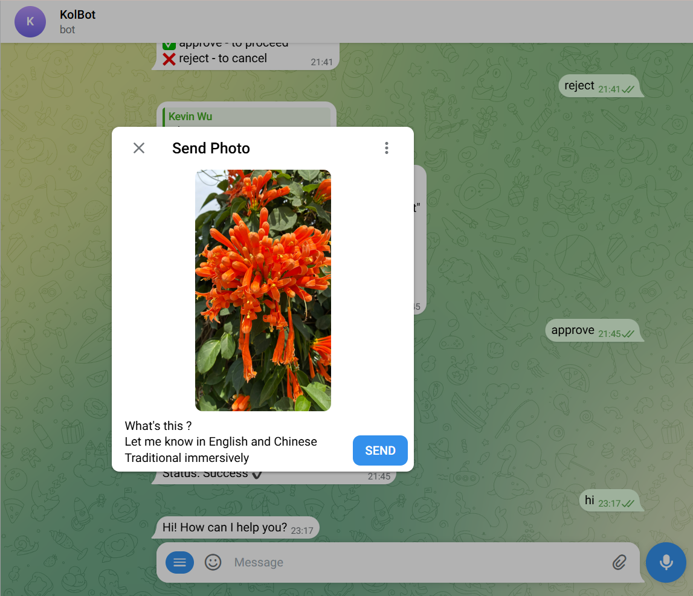 |  |

### Discord

| 提問 | 回覆 |
|------|------|
|  | 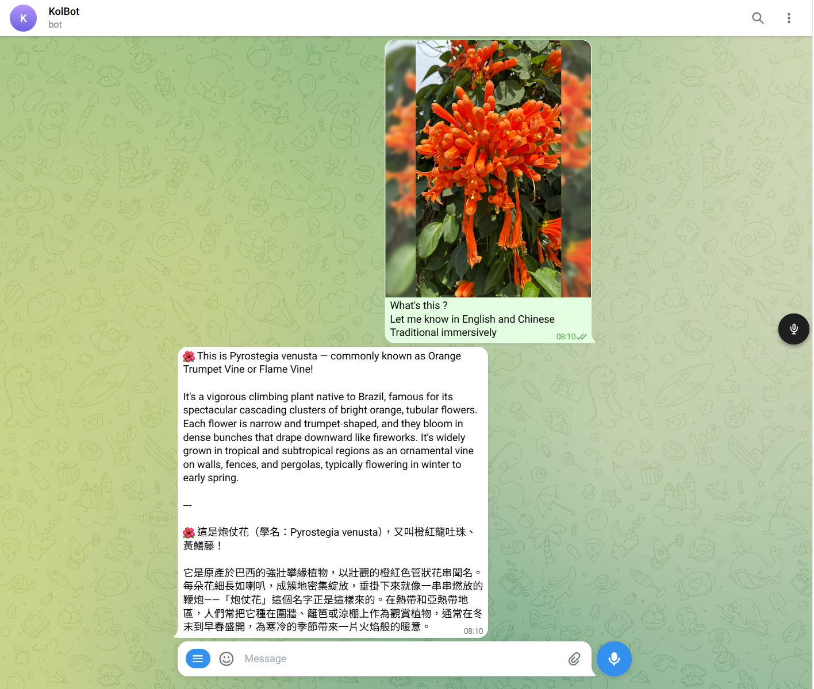 |

### Slack

| 提問 | 回覆 |
|------|------|
| 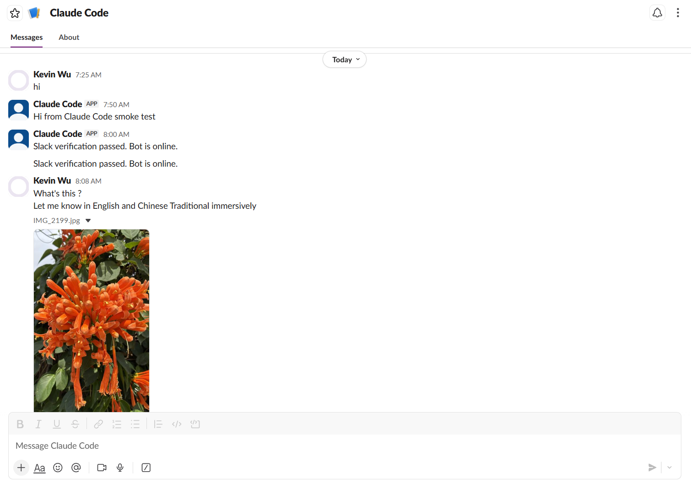 | 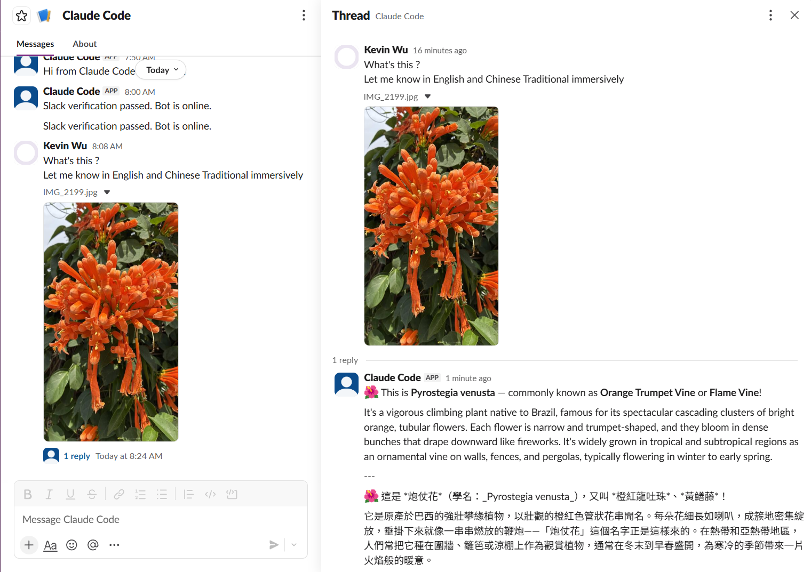 |

### LINE

| 提問（花朵） | 提問（天氣） |
|------|------|
| 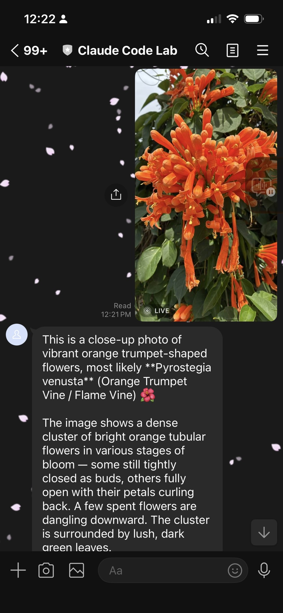 | 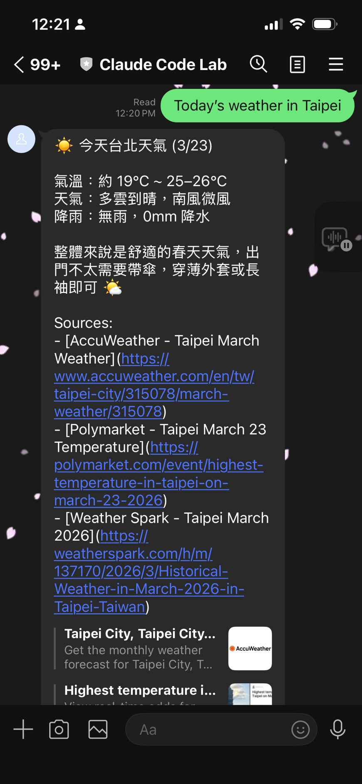 |

### LINE Relay（雲端）

| 提問（EN） | 提問（zh-TW） |
|------|------|
| 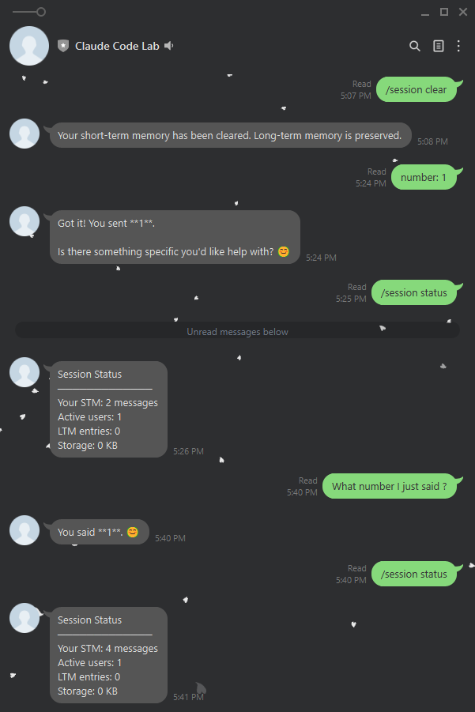 | 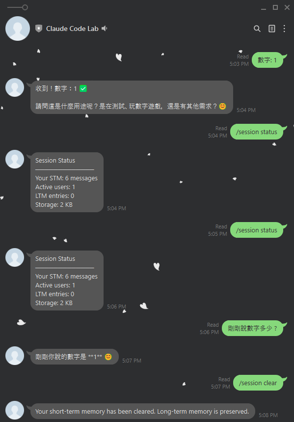 |

### WhatsApp Relay（雲端）

| 提問（花朵） | 提問（天氣） |
|------|------|
| 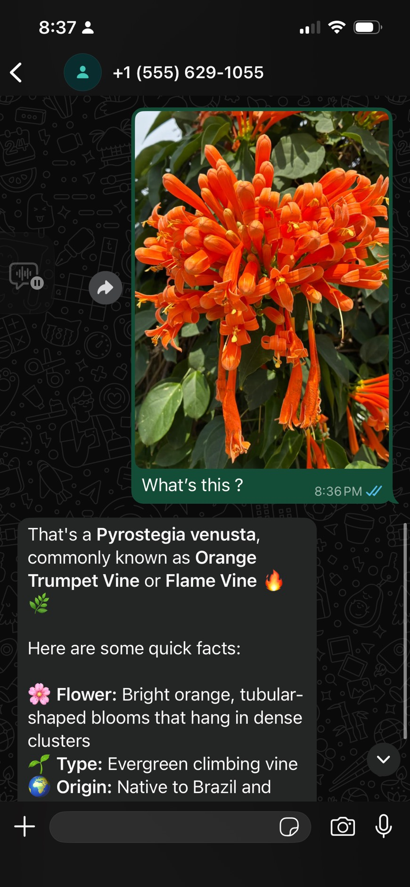 | 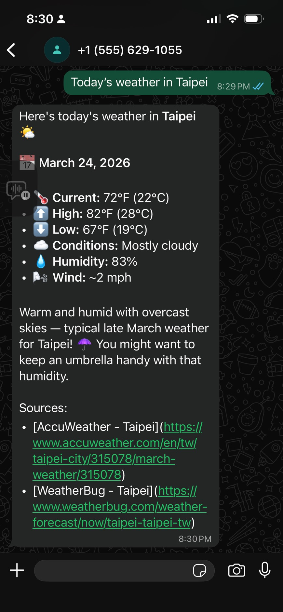 |

### Claude Code 終端

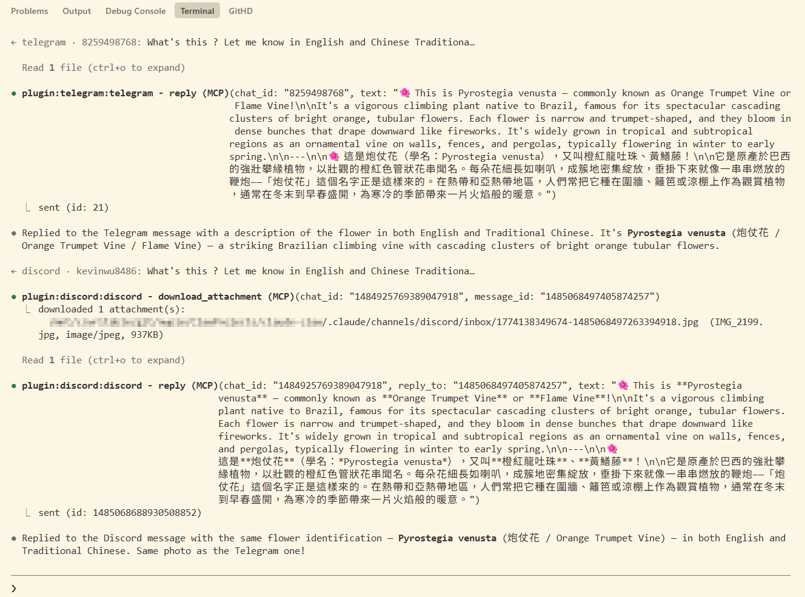

## 文件

### 各 Channel

- [Telegram — 安裝與整合筆記](docs/telegram/install.zh-tw.md)
- [Telegram — 規劃文件](docs/telegram/plan.zh-tw.md)
- [Discord — 安裝與整合筆記](docs/discord/install.zh-tw.md)
- [Discord — 規劃文件](docs/discord/plan.zh-tw.md)
- [Slack — 安裝與整合筆記](docs/slack/install.zh-tw.md)
- [Slack — 規劃文件](docs/slack/plan.md)
- [LINE — 安裝與整合筆記](docs/line/install.zh-tw.md)
- [LINE — 規劃文件](docs/line/plan.zh-tw.md)
- [LINE — Relay 部署指南](docs/line/relay.md)
- [WhatsApp — 安裝與整合筆記](docs/whatsapp/install.zh-tw.md)
- [WhatsApp — 規劃文件](docs/whatsapp/plan.md)
- [Teams — 安裝與整合筆記](docs/teams/install.zh-tw.md)
- [Teams — 規劃文件](docs/teams/plan.md)

### 一般

- [前置條件（Bun、Claude Code）](docs/prerequisites.zh-tw.md)
- [插件架構](docs/plugins/architecture.zh-tw.md)（[English](docs/plugins/architecture.md)）
- [Session 記憶](docs/broker/memory.md)
- [安全與防濫用](docs/broker/safety.md)
- [已知問題（跨 channel）](docs/issues.md)
- [貢獻指南](CONTRIBUTING.md)
- [安全政策](SECURITY.md)
- [更新日誌](CHANGELOG.md)

## 授權

[MIT](LICENSE)
